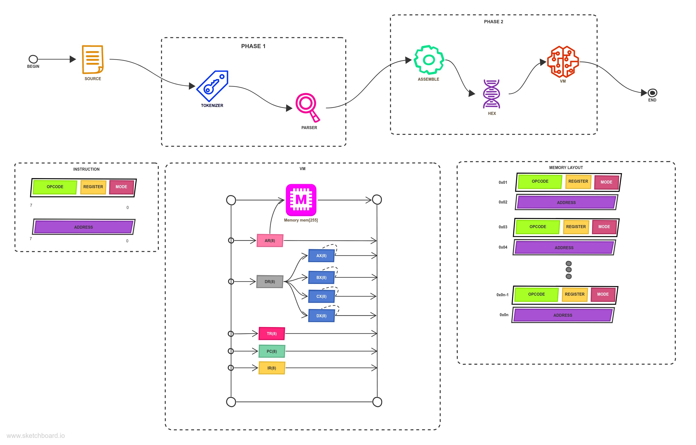
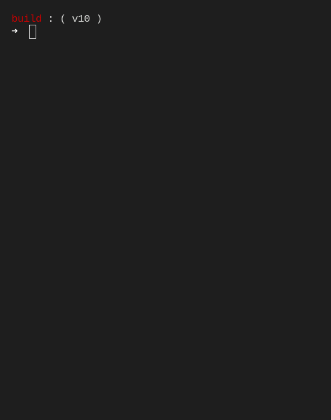
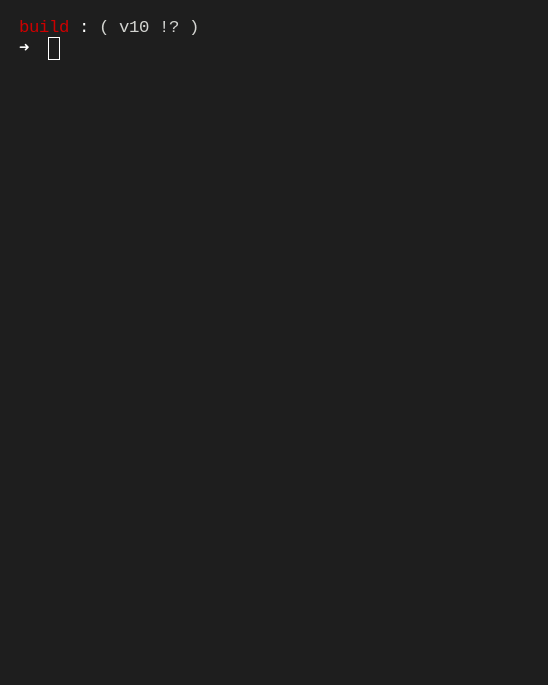
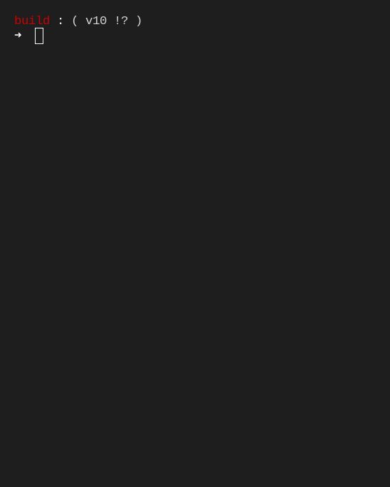

<div align="center"><h1>Assembler</h1>

[](https://github.com/csergen/Assembler/actions/workflows/cmake.yml)
[](https://www.codacy.com/gh/csergen/Assembler/dashboard?utm_source=github.com&amp;utm_medium=referral&amp;utm_content=csergen/Assembler&amp;utm_campaign=Badge_Grade)
[](https://app.circleci.com/pipelines/github/csergen/Assembler?invite=true)
</div>

 *`version: 11, gcc: 11.1.1`*
| Platform | Version | Status |
| --- | --- | --- |
|    |`33, 34` `64 bit`   | `PASSED ✅`|
|    |`18.04 LTS` `64 bit`| `PASSED ✅`|
| |`10` `64 bit`       | `FAILED ❌`|


# **Getting Started**



## Build with make ( **`version 4.3`** )
```console
$ make
$ make clean
```

## Build with  ( **`version 3.19.7`** )
```console
$ cmake -S . -B build/Debug -D CMAKE_BUILD_TYPE=Release
$ cd build/Debug
$ ./Assembler <source_file_path>
```
## Build with  ( **`version 20.10.6`** )
```xml
$ sudo systemctl start docker
$ sudo docker build -t <custom_image_name> <dockerfile_path>
$ sudo docker run -it --rm --name <custom_container_name> <custom_image_name>
```

# **Style Guide**

### Code Definition
```assembly
OPCODE REGISTER,[REGISTER, MEMORY, IMMEDIATE]

# example
HRK AX, BX
    or
HRK AX, [<variable_name>]
    or
HRK AX, 10
```

### Variable Definition
```assembly
<variable_name>: <immediate>

# example
var1: 10
    or
var1: -10
```

### Branching
```assembly

<LABEL>: <NEWLINE>
    something
    <BRANCHING_OPCODE> <LABEL>

# example
LOP:
    TOP AX, 10
    SS LOP
```

# **Grammar ( ebnf )**
```yaml
program = field, { field };

field 
= [label],
  [variable],
  opcode, register
  [',', (register | memory_addressing | immediate)]
  newline;

label 
= STRING ':' newline;

variable
= STRING ':' immediate;

opcode
=  HRK
  |TOP
  |CIK
  |CRP
  |BOL
  |DEG
  |VE
  |VEYA
  |SS
  |SSD
  |SN
  |SP;

register 
=  AX
  |BX
  |CX
  |DX;

memory_addressing
= '[', ADDRESS, ']';

immediate
= { decimal };


decimal = { 0-9 | d, ', {0-9}, ' };

newline = { [\n] | [\r\n] };
```


# **EXAMPLES**

### Factorial


```assembly
RN: 5

HRK AX, [RN]
HRK CX, AX

FACT: 
      CIK AX, 1
      SS END
      CRP CX, AX
      SP FACT

END:
```

### Fibonacci


```assembly
x1: 1
x2: 1

HRK AX, [x1]
HRK BX, [x2]

FIB:
  HRK CX, AX
  TOP AX, BX
  HRK DX, AX
  HRK BX, CX
  HRK AX, DX
  SP FIB
```

### Counter Example


```assembly
co: 1

HRK AX, 10
HRK BX, 0

HRK CX, AX
DEG CX
TOP CX, 1

LOP:
  TOP BX, [co]
  TOP CX, [co]
  SSD LOP
  SS DEC

DEC:
  CIK BX, [co]
  SP DEC
```

# **DEFINITIONS**

### OPCODES
```
hrk   0000    0
top   0001    1
crp   0010    2
cik   0011    3
bol   0100    4
ve    0101    5
veya  0110    6
deg   0111    7
ss    1000    8
ssd   1001    9
sn    1010    A
sp    1011    B
```


### REGISTERS
```
ax  00  0
bx  01  1
cx  10  2
dx  11  3
```

### ADDRESSING MODE
```
jumping     00  0
register    01  1
memory      10  2
immediate   11  3
```

### INSTRUCTION TABLE

#### HRK
```assembly
hrk reg(ax), reg(?)     0000 00 01  01
hrk reg(bx), reg(?)     0000 01 01  05
hrk reg(cx), reg(?)     0000 10 01  09
hrk reg(dx), reg(?)     0000 11 01  0D

hrk reg(ax), memory     0000 00 10  02
hrk reg(bx), memory     0000 01 10  06
hrk reg(cx), memory     0000 10 10  0A
hrk reg(dx), memory     0000 11 10  0E

hrk reg(ax), immediate  0000 00 11  03
hrk reg(bx), immediate  0000 01 11  07
hrk reg(cx), immediate  0000 10 11  0B
hrk reg(dx), immediate  0000 11 11  0F
```

#### TOP
```assembly
top reg(ax), reg(?)     0001 00 01  11
top reg(bx), reg(?)     0001 01 01  15
top reg(cx), reg(?)     0001 10 01  19
top reg(dx), reg(?)     0001 11 01  1D

top reg(ax), memory     0001 00 10  12
top reg(bx), memory     0001 01 10  16
top reg(cx), memory     0001 10 10  1A
top reg(dx), memory     0001 11 10  1E

top reg(ax), immediate  0001 00 11  13
top reg(bx), immediate  0001 01 11  17
top reg(cx), immediate  0001 10 11  1B
top reg(dx), immediate  0001 11 11  1F
```

#### CRP
```assembly
crp reg(ax), reg(?)     0010 00 01  21
crp reg(bx), reg(?)     0010 01 01  25
crp reg(cx), reg(?)     0010 10 01  29
crp reg(dx), reg(?)     0010 11 01  2D

crp reg(ax), memory     0010 00 10  22
crp reg(bx), memory     0010 01 10  26
crp reg(cx), memory     0010 10 10  2A
crp reg(dx), memory     0010 11 10  2E

crp reg(ax), immediate  0010 00 11  23
crp reg(bx), immediate  0010 01 11  27
crp reg(cx), immediate  0010 10 11  2B
crp reg(dx), immediate  0010 11 11  2F
```

#### CIK
```assembly
cik reg(ax), reg(?)     0011 00 01  31
cik reg(bx), reg(?)     0011 01 01  35
cik reg(cx), reg(?)     0011 10 01  39
cik reg(dx), reg(?)     0011 11 01  3D

cik reg(ax), memory     0011 00 10  32
cik reg(bx), memory     0011 01 10  36
cik reg(cx), memory     0011 10 10  3A
cik reg(dx), memory     0011 11 10  3E

cik reg(ax), immediate  0011 00 11  33
cik reg(bx), immediate  0011 01 11  37
cik reg(cx), immediate  0011 10 11  3B
cik reg(dx), immediate  0011 11 11  3F
```

#### BOL
```assembly
bol reg(ax), reg(?)     0011 00 01  41
bol reg(bx), reg(?)     0011 01 01  45
bol reg(cx), reg(?)     0011 10 01  49
bol reg(dx), reg(?)     0011 11 01  4D

bol reg(ax), memory     0011 00 10  42
bol reg(bx), memory     0011 01 10  46
bol reg(cx), memory     0011 10 10  4A
bol reg(dx), memory     0011 11 10  4E

bol reg(ax), immediate  0011 00 11  43
bol reg(bx), immediate  0011 01 11  47
bol reg(cx), immediate  0011 10 11  4B
bol reg(dx), immediate  0011 11 11  4F
```

#### VE
```assembly
ve reg(ax), reg(?)      0101 00 01  51
ve reg(bx), reg(?)      0101 01 01  55
ve reg(cx), reg(?)      0101 10 01  59
ve reg(dx), reg(?)      0101 11 01  5D

ve reg(ax), memory      0101 00 10  52
ve reg(bx), memory      0101 01 10  56
ve reg(cx), memory      0101 10 10  5A
ve reg(dx), memory      0101 11 10  5E

ve reg(ax), immediate   0101 00 11  53
ve reg(bx), immediate   0101 01 11  57
ve reg(cx), immediate   0101 10 11  5B
ve reg(dx), immediate   0101 11 11  5F
```

#### VEYA
```assembly
veya reg(ax), reg(?)    0110 00 01  61
veya reg(bx), reg(?)    0110 01 01  65
veya reg(cx), reg(?)    0110 10 01  69
veya reg(dx), reg(?)    0110 11 01  6D

veya reg(ax), memory    0110 00 10  62
veya reg(bx), memory    0110 01 10  66
veya reg(cx), memory    0110 10 10  6A
veya reg(dx), memory    0110 11 10  6E

veya reg(ax), immediate 0110 00 11  63
veya reg(bx), immediate 0110 01 11  67
veya reg(cx), immediate 0110 10 11  6B
veya reg(dx), immediate 0110 11 11  6F
```

#### DEG
```assembly
deg reg(ax), reg(?)     0111 00 01  71

deg reg(ax), memory     0111 00 10  72

deg reg(ax), immediate  0111 00 11  73
```

#### SS
```assembly
ss jumping              1000 00 00  80
```

#### SSD
```assembly
ssd jumping             1001 00 00  90
```

#### SN
```assembly
sn jumping              1010 00 00  A0
```

#### SP
```assembly
sp jumping              1011 00 00  B0
```


